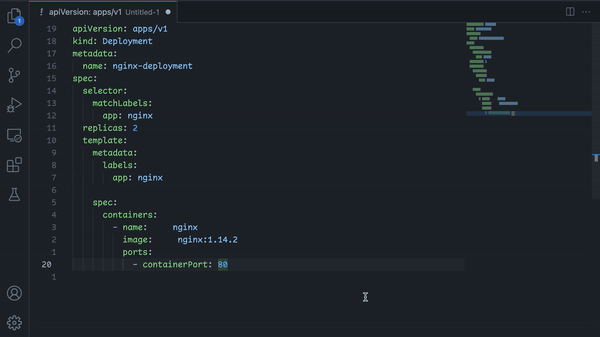

# Kubernetes Style YAML Formatter for Visual Studio Code

A [Visual Studio Code](https://code.visualstudio.com/) [extension](https://marketplace.visualstudio.com/items?itemName=kennylong.kubernetes-yaml-formatter) that provides format support for [YAML](https://yaml.org) language.

You find the right format extension if you come from DevOps world, e.g., [Kubernetes](https://kubernetes.io/docs/concepts/), [Ansible Playbooks](https://docs.ansible.com/ansible/latest/user_guide/playbooks_intro.html) or CI workflow like [Github Actions](https://docs.github.com/en/actions) and so on.

As a Kubernetes developer, aka YAML engineer, you deal with a lot of yaml files everyday. Take the k8s yaml for example:

```yaml
apiVersion: apps/v1
kind: Deployment
metadata:
  name: nginx-deployment
spec:
  selector:
    matchLabels:
      app: nginx
  replicas: 2
  template:
    metadata:
      labels:
        app: nginx
    spec:
      containers:
      - name: nginx
        image: nginx:1.14.2
        ports:
        - containerPort: 80
```

As you see, the sequence style(`containers` and `ports`) in the k8s style yaml has no indent. Each time you play with [kubectl](https://kubernetes.io/docs/reference/kubectl/), there is no indent. Not to mention some tool like [kustomize](https://github.com/kubernetes-sigs/kustomize) [requires you do that](https://github.com/kubernetes-sigs/kustomize/issues/3946).

Unluckily, the builtin yaml format has its own [option philosophy](https://prettier.io/docs/en/option-philosophy.html). It always does indent and [resists to accept](https://github.com/prettier/prettier/issues/12385) such a customization setting.

It's useless. I have to keep the style manually every time editing yaml files, or you will end up with a non-idiomatic one.

It's tedious. So I create this extension to make life easier. Now you can control which way you prefer and everyone is happy.

**Enjoy!**

## Features



## Extension Settings

This extension contributes the following settings:

* `kubernetes-yaml-formatter.compactSequenceIndent`: Enable/disable compact sequence indent, i.e. no indent.

It makes format yaml on save default to `true`, you can disable it:

```json
"[yaml]": {
  "editor.formatOnSave": false
}
```

## Thanks

Thanks [lupengpeng](https://github.com/iamlupeng1991) for the icon design. It's great!

Thanks the following projects:

* [google/yamlfmt](https://github.com/google/yamlfmt)
* [go-yaml](github.com/natasha41575/yaml)

Without them there wouldn't be this extension.

Throughout the process I learnt a lot and also made some contributions back to them.

Definitely welcome your patches and contributions!
